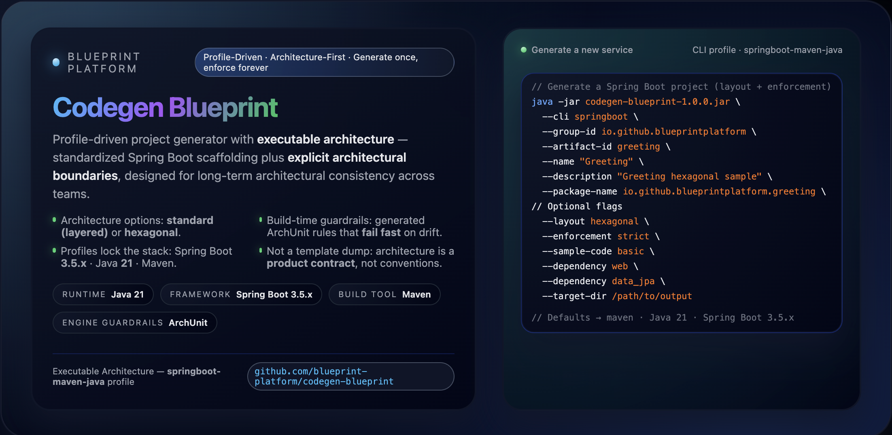
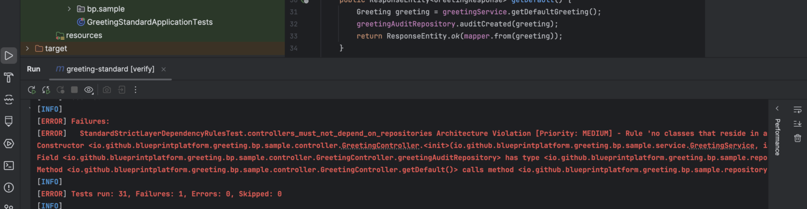
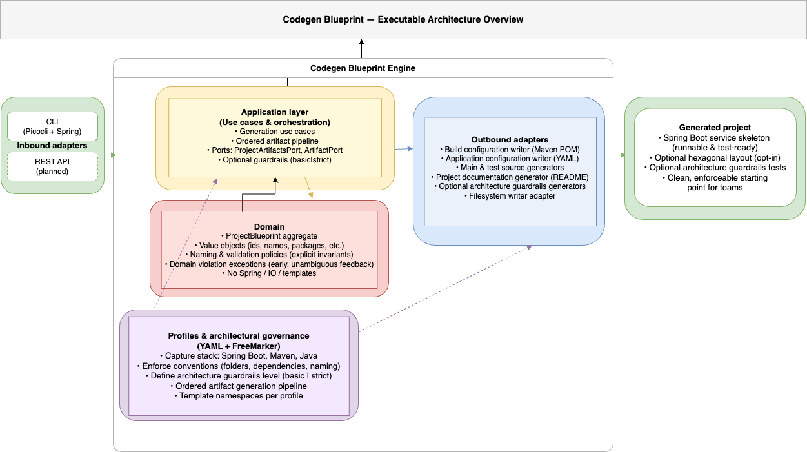

# Codegen Blueprint — Architecture-First Project Generator

[](https://github.com/blueprint-platform/codegen-blueprint/actions/workflows/build.yml)
[](https://github.com/blueprint-platform/codegen-blueprint/releases/latest)
[](https://github.com/blueprint-platform/codegen-blueprint/actions/workflows/codeql.yml)
[](https://codecov.io/gh/blueprint-platform/codegen-blueprint/tree/main)

[](https://openjdk.org/)
[](https://spring.io/projects/spring-boot)
[](https://maven.apache.org/)

[](LICENSE)

<p align="center">
  
</p>

> **Codegen Blueprint** generates projects where architectural boundaries are not conventions — they are **observable, testable, and enforced by the build from day one**.
---

## 🧪 Proof (what you’ll actually see)

Before you run a single command, here is the **irreducible proof**:

* a real architectural boundary is violated
* the build evaluates that intent
* the build **fails deterministically**

No application startup. No runtime checks. No conventions to trust.

> **Visual proof — build-time failure (inspectable without cloning):**



*This failure is produced by a **generated ArchUnit rule** and evaluated during `mvn verify`. Nothing runs. The build itself enforces the architecture.*

---

## ⚡ 60-second quick start

See the guardrails in action in under a minute:

```bash
git clone https://github.com/blueprint-platform/codegen-blueprint
cd codegen-blueprint

./mvnw clean package

java -jar target/codegen-blueprint-*.jar \
  --cli springboot \
  --group-id demo \
  --artifact-id demo \
  --name "Demo" \
  --description "Demo project" \
  --package-name demo \
  --layout hexagonal \
  --guardrails strict \
  --dependency web
```

Then:

```bash
cd demo
./mvnw verify
```

👉 Break a boundary → **watch the build fail**

---

> This is the fastest way to understand what Codegen Blueprint actually does.

---

> Especially in an AI-assisted development era, where code is produced faster than it is reviewed, **architectural drift is no longer a risk — it is the default**.

---

### What this single image already proves

* Architectural rules are **generated**, not documented
* Violations are detected **at build time**
* The feedback is **deterministic and explicit**
* Architecture cannot silently drift

---

### Want to inspect the exact failures and screenshots?

👉 **[Proof — Explained Walkthrough](docs/demo/executable-architecture-proof.md#high-resolution-walkthrough-manual-proof)**

This shows:

* the generated structure
* the exact forbidden change
* the precise ArchUnit rule that fails
* the corresponding build output

---

### Want to reproduce it yourself (console‑first)?

👉 **[Proof — Console Execution (GREEN → RED → GREEN)](docs/demo/executable-architecture-proof.md#fast-proof-console-first)**

This path is for readers who want **hands‑on verification** using `mvn verify`.

---

## If you’ve ever…

* Your codebase started clean — then **architecture drifted silently** once things were “up and running”.
* A new developer (or a rushed change) shipped code into the **wrong layer** — and the only “rule” was tribal knowledge.
* Reviews turned into **“is this the right boundary?”** debates — because nothing was **executable**.

Codegen Blueprint exists for the moment when architectural intent must stop being *assumed* and start being **observable, testable, and enforced by the build**.

It is designed for teams who care about **architectural integrity over time**, and want boundaries that remain **visible and verifiable** as systems, teams, and pressure evolve.

---

> **Background reading**
>
> If you want the broader architectural context behind this repository:
>
> * [Why Architecture Drift Is Faster Than Ever — And Why AI Makes Guardrails Mandatory](https://medium.com/@baris.sayli/why-architecture-drift-is-faster-than-ever-and-why-ai-makes-guardrails-mandatory-4854e13309c4)
    >   Why build-time architecture guardrails matter — especially under AI-speed refactoring.
>
> * [The Project That Finally Taught Me Hexagonal Architecture](https://dev.to/barissayli/the-project-that-finally-taught-me-hexagonal-architecture-1c5h)
    >   The real project journey behind the engine — how architectural struggle, reset, and rebuild shaped Codegen Blueprint.

---

## 📑 Table of Contents

* 🤔 [Should you clone this repository?](#-should-you-clone-this-repository)
* 🛡 [1.0.x GA promise (non-negotiable)](#-10x-ga-promise-non-negotiable)
* ⚡ [What is Codegen Blueprint (today)?](#-what-is-codegen-blueprint-today)
* 🎯 [Who is this for?](#-who-is-this-for)
* 🧱 [Architecture Overview](#-architecture-overview)
* 🥇 [What makes Codegen Blueprint different?](#-what-makes-codegen-blueprint-different)
* 🧪 [Executable Architecture — proof](#-executable-architecture--proof)
* 📦 [Release & compatibility discipline](#-release--compatibility-discipline)
* 🚫 [What we explicitly do NOT guarantee](#-what-we-explicitly-do-not-guarantee)
* 🧩 [Generate vs deliver capabilities (cross-cutting concerns)](#-generate-vs-deliver-capabilities-cross-cutting-concerns)
* 🧩 [Part of the Blueprint Platform](#-part-of-the-blueprint-platform)
* 🧭 [1.0.x Release Scope](#-10x-release-scope)
* 🔌 [Inbound & Outbound Adapters](#-inbound--outbound-adapters)
* 🔄 [CLI Usage (Spring Boot)](#-cli-usage-spring-boot)
* 🧪 [Guardrails — Architecture Feedback Loop](#-guardrails--architecture-feedback-loop)
* 🧪 [Testing & CI (This Repository)](#-testing--ci-repository-integrity)
* 🚀 [Vision & Roadmap](#-vision--direction)
* 🤝 [Contributing](#-contributing)
* ⭐ [Real World Feedback](#-real-world-feedback)
* 🛡 [License](#-license)

---

## 🤔 Should you clone this repository?

Clone this project if **architecture drift** has ever cost you time, quality, or trust — and you want boundaries that are **observable in the build**, not implied in docs.

**Codegen Blueprint is not a faster way to scaffold a project.**
It turns architectural intent into **executable guardrails** with **fast, deterministic feedback** during `mvn verify`.

### ✅ Best fit

* You optimize for **long‑term maintainability**, not day‑one scaffolding speed.
* You want **build‑time signals** when boundaries are crossed.
* You prefer **explicit contracts** over tribal knowledge and reviewer debates.

### 🚫 Not the best fit

* You only need a quick starter template without build-time guardrails.
* You expect cross‑cutting runtime behavior (security/logging/etc.) to be generated as boilerplate.

---

## 🛡 1.0.x GA promise (non-negotiable)

**What you get with every generated project (1.0.x):**

* **Architecture guardrails included by default** (`basic`) — explicit opt-out only (`--guardrails none`)
* **Build-time enforcement** via generated ArchUnit tests (`mvn verify`)
* **Deterministic failure** when boundaries are violated (no runtime, no conventions)
* **Explicit modes** (`basic` / `strict`) — you choose the enforcement level

> This is not a guideline — it is a **build-enforced contract**.

> **Source of truth (binding):**
> [Executable Architecture Contract — 1.0.x GA](docs/architecture/executable-architecture-contract.md)

---

## ⚡ What is Codegen Blueprint (today)?

**A CLI that generates Spring Boot projects with architecture already enforced by the build — not left to conventions.**

It gives you, from day one:

* **Deterministic project generation** (same input → same output)
* **Buildable, test-ready output** (`mvn verify` passes immediately)
* **Explicit architecture choice**: `standard` (layered) or `hexagonal`
* **Build-time guardrails** via generated ArchUnit tests
* **Framework-free domain by construction**

📌 **Current GA profile:** `springboot-maven-java`

> Spring Boot **3.4 / 3.5** · Java **21** · Maven **3.9+**

This is not a template.
This is **architecture generated as an executable contract**.

---

### Spring Boot versioning

Codegen Blueprint uses **deterministic patch versions**.

| Input | Resolved version |
|------|------------------|
| 3.5  | 3.5.14           |
| 3.4  | 3.4.13           |

This ensures:

- reproducible builds
- consistent outputs
- no implicit "latest version" resolution

---

## 🎯 Who is this for?

This is for teams who want architecture to **stay correct under pressure** — not just start clean.

You’ll get the most value if:

* You’ve seen **architecture drift after initial delivery**
* You want **fast feedback when boundaries are violated**
* You prefer **enforced structure over review-time debates**

| If you are...     | You get...                                         |
| ----------------- | -------------------------------------------------- |
| Platform Engineer | Org-wide standards that are **enforced by build**  |
| Lead Architect    | Boundaries that are **observable and testable**    |
| Developer         | Less ambiguity, faster feedback loops              |
| New Team Member   | Structure that teaches the architecture implicitly |

---

## 🧱 Architecture Overview

📘 **Canonical platform definition:**

→ [Architecture as a Product — Platform Specification](https://github.com/blueprint-platform/blueprint-platform-spec/blob/main/specs/architecture-as-a-product.md)

This repository is the **executable implementation** of that idea.

Architecture here is not described — it is:

* **generated**
* **evaluated**
* **verified at build time**

---

### Generator Architecture (Engine)

The generator itself is built using **Hexagonal Architecture** — as a structural constraint, not a style.

This ensures the engine:

* stays **framework-agnostic**
* evolves across delivery surfaces (CLI → REST)
* avoids core rewrites over time

At its core:

* **Domain & use cases define what happens**
* **Adapters define how it is triggered**

> The core remains stable. Adapters evolve.

<p align="center">
  
</p>

Spring Boot is a **delivery adapter**, not a foundation.

---

### Architecture documentation

*(contract → rulebook → guides → collaboration)*

* 🔒 **Executable Architecture Contract — 1.0.x GA**
  [Executable Architecture Contract — 1.0.x GA](docs/architecture/executable-architecture-contract.md)

* 📜 **Architecture Guardrails Rulebook** *(semantics)*
  [Architecture Guardrails Rulebook](docs/architecture/architecture-guardrails-rulebook.md)

* 🧭 **Hexagonal Architecture Guide**
  [Hexagonal Architecture Guide](docs/guides/how-to-explore-hexagonal-architecture.md)

* 🧠 **Architecture Governance & AI Protocol**
  [Architecture Governance & AI Protocol](docs/architecture/architecture-governance-and-ai-protocol.md)

---

## 🥇 What makes Codegen Blueprint different?

Most generators optimize for **starting fast**.

Codegen Blueprint optimizes for **staying correct over time**.

| Focus area              | Traditional generators | Codegen Blueprint          |
| ----------------------- | ---------------------- | -------------------------- |
| Goal                    | Start quickly          | **Stay correct over time** |
| Architecture boundaries | Docs / conventions     | **Build-enforced**         |
| Drift detection         | Manual                 | **Automatic (build-time)** |
| Domain isolation        | Optional               | **By construction**        |
| Long-term evolution     | Out of scope           | **First-class concern**    |

> It doesn’t try to make starting easier — it makes **drift impossible to ignore**.

---

## 🧪 Executable Architecture — proof

👉 [Executable Architecture Proof](docs/demo/executable-architecture-proof.md)

---

## 📦 Release & compatibility discipline

Versions represent **architecture contracts**, not feature counts.

* MAJOR → contract reset
* MINOR → backward-compatible expansion
* PATCH → stabilization only

👉 [Release Discipline](docs/policies/release-discipline.md)

---

## 🚫 What we explicitly do NOT guarantee

This project is intentionally constrained to protect architectural integrity.

👉 [What We Do NOT Guarantee](docs/policies/what-we-do-not-guarantee.md)

---

## 🧩 Generate vs deliver capabilities (cross-cutting concerns)

Most generators solve cross-cutting concerns by **generating more code**.

That approach does not scale.

Every generated service becomes a new copy of:

* security rules
* logging configuration
* error handling

Over time, this leads to:

* **architecture drift**
* **copy-paste divergence**
* **painful, inconsistent upgrades**

Codegen Blueprint takes a different approach.

| Approach                | What actually happens                                        | Long-term effect                          |
| ----------------------- | ------------------------------------------------------------ | ----------------------------------------- |
| Generate code           | Cross-cutting logic is duplicated into every service         | ❌ Drift, duplication, upgrade friction    |
| Deliver as capabilities | Behavior is centralized, versioned, and applied consistently | ✔ Consistency, alignment, easier upgrades |

> Cross-cutting concerns should not be copied.
> They should be **delivered, versioned, and governed**.

---

## 🧩 Part of the Blueprint Platform

`codegen-blueprint` is the entry point of the **Blueprint Platform**.

It establishes the foundation where:

* architecture is **explicit**
* boundaries are **testable**
* behavior can later be **delivered as capabilities**

→ This repository focuses on **structure and enforcement**.
→ Platform capabilities (security, observability, etc.) are layered **on top**, not generated into code.

🔗 Learn more at the [Blueprint Platform GitHub organization](https://github.com/blueprint-platform)

---

## 🧭 1.0.x Release Scope

> 📌 The `main` branch reflects the **1.0.x GA contract line**.

### What is guaranteed (1.0.x)

* **Deterministic generation** — same input → same output
* **CLI as the source of truth** — no hidden behavior
* **Explicit architecture choice** — standard or hexagonal
* **Build-time guardrails** — via generated ArchUnit tests
* **Test-ready output** — `mvn verify` passes by default
* **Profile-driven stack selection** — controlled, predictable
* **Framework-free domain core** — no Spring in the domain

> These are **contractual guarantees**, not best-effort behavior.

> Full contract:
> [Executable Architecture Contract — 1.0.x GA](docs/architecture/executable-architecture-contract.md)

---

## 🔌 Inbound & Outbound Adapters

The engine is structured so that **the core stays stable while delivery evolves**.

### Inbound (Delivery) — how generation is triggered

| Adapter | Status     | Description                                            |
| ------- | ---------- | ------------------------------------------------------ |
| CLI     | ✔ GA Ready | Primary entry point for project generation             |
| REST    | 🚧 Planned | Future interactive onboarding and generation workflows |

### Outbound (Artifacts) — what the engine produces

The generator produces a **complete, buildable service skeleton**:

* Maven POM + Maven Wrapper
* Main & test source structure
* Domain + Application + Adapter layout
* Application configuration (`application.yml`)
* Optional sample code (standard / hexagonal)
* Optional architecture guardrails (ArchUnit tests)
* README and project documentation

> Guardrails are **generated artifacts**, not hardcoded into the engine.

> The core stays clean:
> **domain depends on nothing — adapters depend on the domain**.

---

## 🔄 CLI Usage (Spring Boot)

This section documents the **actual CLI contract** — what is generated today.

> Codegen Blueprint runs as a Spring Boot executable JAR.

```bash
java -jar <jar> --cli springboot <options...>
```

---

### Basic Usage

```bash
java -jar codegen-blueprint-1.0.3.jar \
  --cli springboot \
  --group-id io.github.blueprintplatform \
  --artifact-id greeting \
  --name "Greeting" \
  --description "Greeting sample built with hexagonal architecture" \
  --package-name io.github.blueprintplatform.greeting \
  --layout hexagonal \
  --guardrails strict \
  --sample-code basic \
  --dependency web \
  --target-dir /path/to/output
```

> Tip: `target/codegen-blueprint-1.0.3.jar`

---

### Available Options (`springboot`)

| Option           | Required | Default  | Description                    |
| ---------------- | -------- | -------- | ------------------------------ |
| `--group-id`     | ✔        | –        | Maven groupId                  |
| `--artifact-id`  | ✔        | –        | Maven artifactId               |
| `--name`         | ✔        | –        | Project name                   |
| `--description`  | ✔        | –        | Description (min 10 chars)     |
| `--package-name` | ✔        | –        | Base package                   |
| `--build-tool`   | ✖        | maven    | Currently only Maven           |
| `--language`     | ✖        | java     | Currently only Java            |
| `--java`         | ✖        | 21       | Generated project Java version |
| `--boot`         | ✖        | 3.5      | Spring Boot version            |
| `--layout`       | ✖        | standard | standard / hexagonal           |
| `--guardrails`   | ✖        | basic    | none / basic / strict          |
| `--sample-code`  | ✖        | none     | none / basic                   |
| `--dependency`   | ✖        | –        | Controlled dependency alias    |
| `--target-dir`   | ✖        | .        | Output directory               |

---

### Dependency Aliases (Controlled)

Dependencies are **intentionally constrained**.

```text
web
data_jpa
validation
actuator
security
devtools
```

* Unknown aliases fail fast
* Repeatable: `--dependency web --dependency actuator`

---

### Why This Matters

This is not a free-form generator.

Dependencies are:

* explicitly modeled
* version-aligned
* constrained by design

> Architectural intent is decided at generation time.

---

### Generated Output (Simplified)

```text
greeting/
 ├── pom.xml
 ├── .gitignore
 ├── .mvn/
 ├── src/
 │   ├── main/
 │   └── test/
```

* buildable (`mvn verify`)
* testable
* architecture-aware

---

### Layout Semantics

**standard (layered)**

```text
controller/
service/
repository/
domain/
config/
```

**hexagonal (ports & adapters)**

```text
domain/
application/
adapter/
bootstrap/
```

---

## 🧪 Guardrails — Architecture Feedback Loop

Guardrails create a **fast, explicit feedback loop at build time** — while context is still fresh.

They do not replace design decisions or reviews.
They make architectural boundaries:

* **visible**
* **testable**
* **impossible to ignore once violated**

---

### How to choose a guardrails mode

Use this as a **practical starting point**:

| Situation                                      | Recommended mode |
| ---------------------------------------------- | ---------------- |
| First-time adoption / onboarding               | `basic`          |
| Proof, demo, or strict architecture validation | `strict`         |
| Exceptional / temporary cases only             | `none`           |

---

### Guardrails Modes

| Mode     | Intent & Behavior                                                                                            |
| -------- | ------------------------------------------------------------------------------------------------------------ |
| `basic`  | **Default (1.0.x GA)**. Balanced enforcement. Protects core boundaries without blocking adoption.            |
| `strict` | Strong enforcement. Fails fast on boundary violations. Best for proof-grade validation and critical systems. |
| `none`   | Explicit opt-out. Use only when you intentionally bypass architectural enforcement.                          |

> Default is `basic` to reduce friction.
> `strict` is recommended once boundaries must become a hard contract.

---

### What actually happens

When guardrails are enabled:

```bash
mvn verify
```

* Architecture rules are executed as **generated ArchUnit tests**
* Violations fail the build **deterministically**
* No runtime execution
* No implicit conventions

> If the boundary is wrong, the build fails — immediately.

---

### Important scope clarification

Codegen Blueprint intentionally does **not** generate runtime cross-cutting concerns:

* security
* logging
* observability

These are designed to be delivered later as:

* **versioned capabilities**
* **shared libraries**
* **governed platform behavior**

> The generator focuses on **structure and enforcement**, not runtime duplication.

---

## 🧪 Testing & CI (Repository Integrity)

This repository validates **both the generator and its output**.

### What is verified

* The generator itself (domain, application, adapters)
* Real generated projects (standard + hexagonal)

---

### Local verification

```bash
mvn verify
```

This runs:

* unit tests
* integration tests
* internal architecture rules

---

### CI guarantee (why this matters)

The pipeline ensures:

> A generator build cannot be green if generated projects are broken.

---

### CI Strategy (simplified)

| JDK     | Purpose                                             |
| ------- | --------------------------------------------------- |
| Java 21 | Full GA validation (generator + generated projects) |
| Java 25 | Forward-compat smoke signal                         |

Additional checks:

* CodeQL (security)
* JaCoCo + Codecov (coverage)

---

### Key takeaway

Generated projects are not assumed to work.
They are **built and verified continuously**.

> Architecture is treated as a **continuously validated contract** — not a one-time setup.

---

## 🚀 Vision & Direction

Architecture should not only be defined — it should:

* execute
* remain observable
* stay verifiable months later

---

### The goal

Blueprint Platform exists to make architecture:

* **explicit**
* **testable**
* **evolvable at scale**

This is achieved through:

* Architecture as a product (structure + guardrails)
* Capabilities delivered via libraries (not generated code)
* Consistency that survives team and system growth

---

### Evolution model (why ordering matters)

The platform evolves in layers:

1. **Prove the contract** — deterministic generation + guardrails
2. **Expand delivery surfaces** — CLI → REST (same core)
3. **Introduce capabilities** — shared, versioned behavior
4. **Expand stacks carefully** — only after contract maturity

> Structure first. Capabilities later. Expansion last.

---

### Roadmap (high level)

**Phase 1 — Contract & Proof (1.0.x GA)**

* Deterministic generation
* Executable guardrails
* Verified generated output

**Phase 2 — Delivery Surfaces**

* REST adapter
* Interactive onboarding

**Phase 3 — Platform Capabilities**

* Security, observability, resilience via shared libraries

**Phase 4 — Stack Expansion**

* Gradle, Kotlin, additional ecosystems

---

### Why this matters

| Without Blueprint              | With Blueprint                         |
| ------------------------------ | -------------------------------------- |
| Architecture drifts silently   | Drift becomes visible at build time    |
| Boilerplate spreads            | Capabilities stay centralized          |
| Onboarding is slow             | Structure teaches implicitly           |
| Standards depend on discipline | Standards are enforced by construction |

> The platform evolves → projects stay clean → consistency holds.

---

## 🤝 Contributing

Contributions are welcome, especially in:

* Guardrails and architecture improvements
* New profiles and adapters
* Documentation and examples

Start here:

* GitHub Discussions — design and ideas
* GitHub Issues — bugs and tasks

---

## 💬 Real-world feedback

If you're using Codegen Blueprint in real projects, I'd genuinely like to hear:

* where it helped
* where it failed
* what felt missing

This directly shapes the platform direction.

---

## 👤 Maintainer

**Barış Saylı** — Creator & Maintainer

* GitHub: [https://github.com/bsayli](https://github.com/bsayli)
* LinkedIn: [https://www.linkedin.com/in/bsayli](https://www.linkedin.com/in/bsayli)
* Dev.to: [https://dev.to/barissayli](https://dev.to/barissayli)
* Medium: [https://medium.com/@baris.sayli](https://medium.com/@baris.sayli)

---

## 🛡 License

MIT — see [LICENSE](LICENSE).
