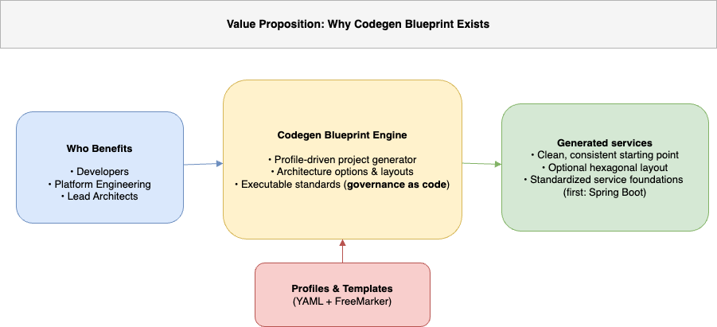

# Codegen Blueprint — Architecture-First Project Generator

[](https://github.com/blueprint-platform/codegen-blueprint/actions/workflows/build.yml)
[](https://github.com/blueprint-platform/codegen-blueprint/releases/latest)
[](https://github.com/blueprint-platform/codegen-blueprint/actions/workflows/codeql.yml)
[](https://codecov.io/gh/blueprint-platform/codegen-blueprint/tree/main)
[](https://openjdk.org/projects/jdk/21/)
[](https://spring.io/projects/spring-boot)
[](https://maven.apache.org/)
[](LICENSE)

<p align="center">
  
</p>

> **Codegen Blueprint** is for teams who care less about *how fast a project starts*
> and more about *how well its architecture survives over time*.

---

## If you’ve ever…

* Your codebase started clean — then **architecture drifted silently** once things were “up and running”.
* A new developer (or a rushed change) shipped code into the **wrong layer** — and the only “rule” was tribal knowledge.
* Reviews turned into **“is this the right boundary?”** debates — because nothing was **executable**.

Codegen Blueprint exists for the moment when architectural intent must stop being *assumed* and start being **observable, testable, and enforced by the build**.

It is designed for teams who care about **architectural integrity over time**, and want boundaries that remain **visible and verifiable** as systems, teams, and pressure evolve.

---

> **Background:** Why build-time architecture guardrails matter (especially under AI-speed refactoring) is explained here:  
> [Why Architecture Drift Is Faster Than Ever — And Why AI Makes Guardrails Mandatory](https://medium.com/@baris.sayli/why-architecture-drift-is-faster-than-ever-and-why-ai-makes-guardrails-mandatory-4854e13309c4)

---

## Proof (what you’ll actually see)

Before you run a single command, here is the **irreducible proof**:

* a real architectural boundary is violated
* the build evaluates that intent
* the build **fails deterministically**

No application startup. No runtime checks. No conventions to trust.

> **Visual proof — build-time failure (inspectable without cloning):**


*This failure is produced by a **generated ArchUnit rule** and evaluated during `mvn verify`.
Nothing runs. The build itself enforces the architecture.*

---

### What this single image already proves

* Architectural rules are **generated**, not documented
* Violations are detected **at build time**
* The feedback is **deterministic and explicit**
* Architecture cannot silently drift

If this is all you look at, you already understand the core value.

---

### Want to inspect the exact failures and screenshots?

For a human‑readable, step‑by‑step walkthrough (screenshots, rule names, and failure output):

👉 **[Proof — Explained Walkthrough](docs/demo/executable-architecture-proof.md#high-resolution-walkthrough-manual-proof)**

This shows:

* the generated structure
* the exact forbidden change
* the precise ArchUnit rule that fails
* the corresponding build output

---

### Want to reproduce it yourself (console‑first)?

If you want to **run the proof locally** and watch **GREEN → RED → GREEN** via the build:

👉 **[Proof — Console Execution (GREEN → RED → GREEN)](docs/demo/executable-architecture-proof.md#fast-proof-console-first)**

This path is for readers who want **hands‑on verification** using `mvn verify`.

---

> **Order is intentional:**
>
> * First: **see** the failure (observable)
> * Then: **inspect** the evidence (explainable)
> * Finally: **run** it yourself (executable)
>
> This is not documentation.
> This is **architecture proven by the build**.

---

## 📑 Table of Contents

* 🤔 [Should you clone this repository?](#-should-you-clone-this-repository)
* 🛡 [1.0.x GA promise (non-negotiable)](#-10x-ga-promise-non-negotiable)
* ⚡ [What is Codegen Blueprint (today)?](#-what-is-codegen-blueprint-today)
* 🎯 [Who is this for?](#-who-is-this-for)
* 🧱 [Architecture Overview](#-architecture-overview)
* 🥇 [What makes Codegen Blueprint different?](#-what-makes-codegen-blueprint-different)
* 🧪 [Executable Architecture — proof](#-executable-architecture--proof)
* 📦 [Release & compatibility discipline](#-release--compatibility-discipline)
* 🚫 [What we explicitly do NOT guarantee](#-what-we-explicitly-do-not-guarantee)
* 🧩 [Generate vs deliver capabilities (cross-cutting concerns)](#-generate-vs-deliver-capabilities-cross-cutting-concerns)
* 🧩 [Part of the Blueprint Platform](#-part-of-the-blueprint-platform)
* 🧭 [1.0.x Release Scope](#-10x-release-scope)
* 🔌 [Inbound & Outbound Adapters](#-inbound--outbound-adapters)
* 🔄 [CLI Usage (Spring Boot)](#-cli-usage-spring-boot)
* 🧪 [Testing & CI (This Repository)](#-testing--ci-this-repository)
* 🚀 [Vision & Roadmap](#-vision--roadmap)
* 🤝 [Contributing](#-contributing)
* ⭐ [Support](#-support)
* 🛡 [License](#-license)

---

## 🤔 Should you clone this repository?

Clone this project if **architecture drift** has ever cost you time, quality, or trust — and you want boundaries that are **observable in the build**, not implied in docs.

**Codegen Blueprint is not a faster way to scaffold a project.**
It turns architectural intent into **executable guardrails** with **fast, deterministic feedback** during `mvn verify`.

### ✅ Best fit

* You optimize for **long‑term maintainability**, not day‑one scaffolding speed.
* You want **build‑time signals** when boundaries are crossed.
* You prefer **explicit contracts** over tribal knowledge and reviewer debates.

### 🚫 Not the best fit

* You only need a quick starter template without build-time guardrails.
* You expect cross‑cutting runtime behavior (security/logging/etc.) to be generated as boilerplate.

---

## 🛡 1.0.x GA promise (non-negotiable)

**Every project generated by Codegen Blueprint 1.0.x includes executable architecture guardrails — enabled by default (`basic`), with explicit opt-out (`--guardrails none`).**

* Guardrails are **generated ArchUnit rules** evaluated at **build time** (`mvn verify`).
* Boundary violations fail the build **deterministically**, while context is still fresh.
* Guardrails are **mode-based** (`basic` / `strict`): selecting the mode is explicit; **disabling is explicit**.
* The goal is not restriction — it’s **protecting architectural intent as the system evolves**.

> **GA contract source of truth**
>
> The guarantee surface is defined exclusively by the  
> [Executable Architecture Contract — 1.0.x GA](docs/architecture/executable-architecture-contract.md).  
> If it’s not listed there, it’s not guaranteed.

---

## ⚡ What is Codegen Blueprint (today)?

A **CLI-driven**, **profile-based**, **architecture-aware** project generator that produces **buildable output** with **configurable architecture guardrails**.

📌 Current GA profile: **springboot-maven-java**

> Generated projects: Spring Boot **3.5 (default)** or **3.4** · Java **21 (GA baseline)** · Maven **3.9+**

It delivers:

* Deterministic, single-module project generation
* Clean `main`/`test` source layout with verified bootstrapping
* Layout options: **standard (layered)** / **hexagonal (ports & adapters)**
* Guardrails via generated ArchUnit tests (default: `--guardrails basic`; options: `none|basic|strict`)
* Maven wrapper + build baseline + `application.yml`
* Optional **basic sample code** (standard + hexagonal)

---

## 🎯 Who is this for?

This diagram summarizes **who benefits**, **what the engine provides**, and **what teams get in return**.

<p align="center">
  
</p>

| Role                 | What it unlocks                                     |
| -------------------- | --------------------------------------------------- |
| Platform Engineering | Org-wide standards made **explicit and verifiable** |
| Lead Architects      | Guardrails contracts made **observable**            |
| Developers           | Less debate, faster feedback loops                  |
| New Team Members     | Architecture learning curve reduced by structure    |

---

## 🧱 Architecture Overview

📘 **Canonical platform specification**

The canonical definition of **Architecture as a Product** is defined at the **platform level**.

→ [Architecture as a Product — Platform Specification](https://github.com/blueprint-platform/blueprint-platform-spec/blob/main/specs/architecture-as-a-product.md)

This repository provides **executable proof** of that specification, with the **Spring Boot · Maven · Java** profile as its current implementation.

Architecture here is not merely described — it is **generated, evaluated, and verified**.

---

### Generator Architecture (Engine)

Codegen Blueprint (the generator itself) is built using **Hexagonal Architecture** —
not as a stylistic choice, but as a **structural guarantee for long-term evolution**.

The engine is intentionally designed to:

* remain **independent of frameworks and build tools**,
* stay **stable as delivery surfaces evolve** (CLI today, REST tomorrow),
* evolve **without rewriting the core**.

> Generate once.  
> Evolve across frameworks, runtimes, and languages — **without rewriting the core**.

At the center of the engine, **use cases and domain logic define the contract**.
All interaction with the outside world happens through **explicit ports**,
implemented by **replaceable adapters at the edges**.

This ensures a clear separation of responsibilities:
the core decides *what* happens,
adapters decide *how* it is triggered or materialized.

<p align="center">
  
</p>

Spring Boot is the **first delivery adapter**, not the foundation.
The engine itself remains **framework-agnostic by construction**.

> This section describes the **generator architecture (engine)**.  
> Generated project layouts (`standard` / `hexagonal`) are explained in the **CLI Usage (Spring Boot)** section below.

---

### Architecture documentation
*(GA contract → rulebook → guide → collaboration)*

- 🔒 **Executable Architecture Contract — 1.0.x GA** — source of truth for all GA guarantees  
  [Executable Architecture Contract — 1.0.x GA](docs/architecture/executable-architecture-contract.md)

- 📜 **Architecture Guardrails Rulebook** — guardrails semantics and rule vocabulary *(not a GA guarantee)*  
  [Architecture Guardrails Rulebook](docs/architecture/architecture-guardrails-rulebook.md)

- 🧭 **Hexagonal Architecture Guide** — ports, adapters, and boundary navigation  
  [Hexagonal Architecture Guide](docs/guides/how-to-explore-hexagonal-architecture.md)

- 🧠 **Architecture Governance & AI Protocol** — decision-making & AI collaboration rules  
  [Architecture Governance & AI Protocol](docs/architecture/architecture-governance-and-ai-protocol.md)

---

## 🥇 What makes Codegen Blueprint different?

Codegen Blueprint does **not** optimize for scaffolding speed, template count,
or framework convenience.

It optimizes for **architectural continuity** —
keeping boundaries **explicit, observable, and verifiable**
as systems, teams, and pressure evolve.

The focus is **after generation**:

* boundaries remain **explicit**
* drift becomes **observable at build time** (`mvn verify`)
* the domain stays **framework-free by construction**

So early architectural decisions remain enforceable — not aspirational.

| Focus area                   | Traditional project generators | Codegen Blueprint |
| ---------------------------- | ------------------------------ | ----------------- |
| Primary goal                 | Fast project start             | **Architectural continuity** |
| Architecture boundaries      | Implicit or documented         | **Executable & verified** |
| Drift detection              | Manual (reviews, discipline)   | **Build-time feedback** |
| Domain isolation             | Optional / framework-led       | **By construction** |
| Long-term evolution strategy | Out of scope                   | **First-class concern** |

Boundaries stay **enforced by the build** — not by memory or review culture.

> It doesn’t try to make starting easy — it makes **staying correct** unavoidable.

---

## 🧪 Executable Architecture — proof

A reproducible walkthrough that demonstrates **GREEN → RED → GREEN** purely through **build‑time guardrails**:

👉 [Executable Architecture Proof](docs/demo/executable-architecture-proof.md)

---

## 📦 Release & compatibility discipline

Versions represent **architectural and compatibility contracts**, not feature counts.

* Breaking changes are introduced **only in major versions**.
* Determinism, structure, and guardrails guarantees are **intentional and protected** starting from **1.0.x GA**.

👉 [Release Discipline](docs/policies/release-discipline.md)

---

## 🚫 What we explicitly do NOT guarantee

Codegen Blueprint is intentionally **constrained by design**.
Some things are out of scope — not by accident, but to protect architectural integrity.

👉 [What We Do NOT Guarantee](docs/policies/what-we-do-not-guarantee.md)

---

## 🧩 Generate vs deliver capabilities (cross-cutting concerns)

Most generators **generate code** for cross-cutting concerns. That approach does not scale.

Codegen Blueprint makes a deliberate distinction:

| Approach                | What happens                                                 | Long-term effect                              |
| ----------------------- | ------------------------------------------------------------ | --------------------------------------------- |
| Generate code           | Copies security/logging/error handling into each service     | ❌ **Drift, copy-paste, painful upgrades**     |
| Deliver as capabilities | Centralized, versioned, opt-in behavior via shared libraries | **✔ Consistency, easier upgrades, alignment** |

> Not everything should be generated.
> Cross-cutting concerns should be **delivered as capabilities**, not duplicated as code.

---

## 🧩 Part of the Blueprint Platform

`codegen-blueprint` is the first foundational module of the **Blueprint Platform** — an ecosystem designed to keep architecture **explicit, testable, and evolvable**.

🔗 Learn more at the [Blueprint Platform GitHub organization](https://github.com/blueprint-platform)

---

## 🧭 1.0.x Release Scope

> 📌 The `main` branch reflects the **1.0.x GA line**.

### Included — GA Guarantees (1.0.x)

The following guarantees define the **1.0.x GA contract surface**.

| Guarantee                        | Description                                                                 |
| -------------------------------- | --------------------------------------------------------------------------- |
| Deterministic project generation | The same inputs produce the same structure and files.                       |
| CLI-driven generation            | The CLI is the source of truth—no UI-only behavior or hidden defaults.      |
| Layout options                   | Standard (layered) and Hexagonal (ports & adapters) layouts can be generated on demand. |
| Architecture guardrails          | Generated ArchUnit rules (default: `basic`; opt-out: `none`; `strict` supported). |
| Test-ready output                | Generated projects are designed to pass `mvn verify` on the GA baseline.    |
| Profile-driven stack selection   | Technology choices are expressed via profiles (not ad-hoc flags).           |
| Framework-free domain core       | No Spring dependencies or annotations in the domain.                        |

> **GA target**
>
> The 1.0.x GA profile targets **Spring Boot 3.4 / 3.5**, **Java 21**, and **Maven**.
> The generator runtime baseline is **Java 21**. Generated output may target newer JDKs (e.g., **Java 25**),
> but that is **not** part of the GA contract.

---

## 🔌 Inbound & Outbound Adapters

Adapters drive interactions **into** and **out of** the core—keeping domain logic isolated, explicit, and testable.

### Inbound (Delivery) — How requests enter

| Adapter | Status     | Description                                           |
| ------- | ---------- | ----------------------------------------------------- |
| CLI     | ✔ GA Ready | Primary driver to generate projects via command line. |
| REST    | 🚧 Planned | Future interactive generation + onboarding UX.        |

### Outbound (Artifacts) — What the engine produces

> Architecture guardrails are generated as **output artifacts**—not hard-wired into the engine.

The generator produces everything required to **build → run → extend** a real service:

* Maven POM + Maven Wrapper
* Main & test source structure
* Domain + Application + Adapter layout
* Application configuration (`application.yml`)
* Optional **basic sample code**, depending on selected layout:

  * **standard (layered)** sample slice
  * **hexagonal (ports & adapters)** sample slice
* Optional **architecture checks (ArchUnit tests)** *(enabled via `--guardrails basic|strict`)*
* README + project documentation
* Filesystem writer that materializes generated artifacts

> The core remains clean: **domain depends on nothing**; adapters depend on the domain.

---
## 🔄 CLI Usage (Spring Boot)

This section documents the **current CLI contract** for Codegen Blueprint **1.0.x**.
It reflects the *actual generated output*—no aspirational flags or placeholder examples.

> **How to run the CLI**
>
> Codegen Blueprint is a Spring Boot executable JAR. The CLI is activated via `--cli`, then the subcommand (e.g. `springboot`) and its options follow.
>
> Example pattern:
>
> `java -jar <jar> --cli springboot <options...>`

---

### Basic Usage

```bash
java -jar codegen-blueprint-1.0.1.jar \
  --cli springboot \
  --group-id io.github.blueprintplatform \
  --artifact-id greeting \
  --name "Greeting" \
  --description "Greeting sample built with hexagonal architecture" \
  --package-name io.github.blueprintplatform.greeting \
  --layout hexagonal \
  --guardrails strict \
  --sample-code basic \
  --dependency web \
  --target-dir /path/to/output
```

> Tip: If you built locally, the typical path is:
>
> `java -jar target/codegen-blueprint-1.0.1.jar --cli springboot ...`

---

### Available Options (`springboot`)

| Option           | Required | Default    | Description                                                                     |
| ---------------- | -------- | ---------- |---------------------------------------------------------------------------------|
| `--group-id`     | ✔        | –          | Maven `groupId`.                                                                |
| `--artifact-id`  | ✔        | –          | Maven `artifactId` (also becomes the output folder name).                       |
| `--name`         | ✔        | –          | Human-readable project name.                                                    |
| `--description`  | ✔        | –          | Project description (**min 10 characters**).                                    |
| `--package-name` | ✔        | –          | Base Java package name.                                                         |
| `--build-tool`   | ✖        | `maven`    | Build tool (**currently only** `maven`).                                        |
| `--language`     | ✖        | `java`     | Programming language (**currently only** `java`).                               |
| `--java`         | ✖        | `21`       | **Generated project** Java version: `21`, `25` — **GA target: 21**.             |
| `--boot`         | ✖        | `3.5`      | **Generated project** Spring Boot version: `3.4`, `3.5` — (GA baseline: `3.5`)  |
| `--layout`       | ✖        | `standard` | Project layout: `standard` or `hexagonal`.                                      |
| `--guardrails`   | ✖        | `basic`    | Guardrails mode: `none`, `basic`, `strict` (**default: basic; opt-out: none**). |
| `--sample-code`  | ✖        | `none`     | Sample code level: `none`, `basic`.                                             |
| `--dependency`   | ✖        | –          | Dependency alias (repeatable; controlled set).                                  |
| `--target-dir`   | ✖        | `.`        | Target directory for generated output.                                          |

---

### Dependency Aliases (Controlled)

Dependency aliases are **intentionally constrained** and mapped internally to well-known Spring Boot starters.
This prevents uncontrolled dependency sprawl and keeps generated projects aligned with the architecture-first intent.

**Available aliases in 1.0.x:**

```text
web
data_jpa
validation
actuator
security
devtools
```

* Unknown aliases fail fast during CLI execution.
* `--dependency` is **repeatable**, e.g.:

```bash
--dependency web --dependency actuator --dependency data_jpa
```

---

### Why This Matters

Codegen Blueprint is **not** a free-form dependency injector.
Dependencies are:

* explicitly modeled
* version-aligned with the selected platform
* constrained by design

This ensures generated projects start with:

* a clean dependency graph
* predictable behavior
* architecture-safe defaults

> Dependency freedom is a runtime concern — **architectural intent is a generation-time concern**.

---

### Generated Output (Simplified)

> The output directory name always equals `--artifact-id`.

```text
greeting/
 ├── pom.xml
 ├── .gitignore
 ├── .mvn/
 │   └── wrapper/
 │       └── maven-wrapper.properties
 ├── src/
 │   ├── main/
 │   │   ├── java/io/github/blueprintplatform/greeting/...
 │   │   └── resources/application.yml
 │   └── test/
 │       └── java/io/github/blueprintplatform/greeting/...
```

The output is:

* buildable (`mvn verify`)
* testable (unit + integration baseline)
* architecture-aware by construction

---

### Layout Semantics

**`standard` layout** (layered packages)

```text
controller/
service/
repository/
domain/
config/
```

**`hexagonal` layout** (ports & adapters)

```text
domain/
application/
adapter/
bootstrap/
```

---

### Architecture Guardrails & Feedback Loop

Guardrails are **opt-in** and create a fast, explicit feedback loop while context is still fresh.
They don’t replace design decisions or reviews—they make boundaries **visible, testable, and hard to miss**.

#### Guardrails Modes

| Mode     | Intent & Behavior                                                                                         |
| -------- |-----------------------------------------------------------------------------------------------------------|
| `basic`  | **Default (1.0.x GA)**. Designed for adoption. Enforces core boundaries without being overly restrictive. |
| `strict` | Recommended for proof-grade, fail-fast validation. Enforces stricter dependency and boundary rules.       |
| `none`   | Explicit opt-out only. Intended for special cases; not recommended for regular use.                       |

> **Default vs recommended**
>
> * Default is `basic` to reduce adoption friction.
> * `strict` is recommended when boundaries must be enforced as a hard, build-time contract.
> * `none` should be a conscious exception.

When enabled, guardrails are generated as executable ArchUnit tests and evaluated during:

```bash
mvn verify
```

Violations fail the build **deterministically**, without application startup and without runtime checks.

### Important Notes

* Codegen Blueprint does **not** generate cross-cutting runtime behavior (security/logging/observability/etc.).
* Those concerns are intended to be delivered and governed via **shared libraries** in later Blueprint Platform phases.
* Generated projects are intentionally minimal, stable, and architecture-first by design.

> Codegen Blueprint optimizes for long-term architectural integrity—not short-term scaffolding volume.

---

## 🧪 Testing & CI (This Repository)

This section describes the CI pipeline of the **Codegen Blueprint repository itself**—not the projects generated by the CLI.

It validates both:

* the generator engine (domain, application, adapter)
* the real output produced by the generator (standard & hexagonal)

### Local verification

```bash
mvn verify
```

Runs unit + integration tests and internal architecture rules for the generator.

### CI overview

GitHub Actions validates the **GA baseline** exhaustively, and uses a **single forward-compat smoke** to detect early breakage.

| JDK         | Purpose                     | What runs                                                           |
| ----------- | --------------------------- | ------------------------------------------------------------------- |
| **Java 21** | **GA baseline (supported)** | Full generator verification + generated-project verification matrix |
| **Java 25** | Forward-compat signal       | One generated-project smoke scenario (strict guardrails + sample)   |

Notes:

* The generator runtime baseline is **Java 21**.
* Generated projects are validated by actually building them (`mvn verify`) in CI.

### Static analysis & reporting

* **CodeQL** — security/static analysis
* **JaCoCo + Codecov** — coverage for the generator codebase (Java 21)

---

### Why This Matters

This CI setup explicitly prevents the class of failures where:

> *“The generator build is green, but the generated project is broken.”*

By validating **real generated projects** across:

* architectural layouts
* guardrails modes
* sample presence
* GA and next-generation JDKs

Codegen Blueprint treats architecture as a **continuously verified contract** —
not a one-time scaffolding decision.

> **If the architecture drifts, the build tells you immediately.**

---

## 🚀 Vision & Roadmap

> Architecture should **execute**, not merely be drawn — and remain observable and verifiable 6, 12, 24 months later.

### 🌟 The Vision

**Blueprint Platform** exists to keep architecture **explicit, testable, and evolvable** across teams and time.

* **Architecture as a product** (structure + guardrails as an executable outcome)
* **Capabilities delivered via libraries + governance** (not copied boilerplate)
* **Consistency that survives scale** (onboarding, upgrades, standards)

From Day Zero to Production — architecture stays **intentional**, **testable**, and **continuously evaluated**.

---

### 🧭 Roadmap Principles (Order Matters)

> This roadmap expresses direction and intent, not contractual guarantees.

Blueprint evolves in intentional layers to protect its core promise:

1. **Prove the contract** (determinism, guardrails, reproducible proof)
2. **Add new delivery surfaces** (CLI → REST) **without changing the core engine**
3. **Deliver cross-cutting capabilities** via **versioned libraries + governance** (no boilerplate generation)
4. **Expand stacks cautiously** only after the proof and contracts mature

> 📌 Ordering matters: capabilities and stack expansion come **after** the architecture contract is proven executable.

---

### 🎯 Roadmap (High Level)

#### Phase 1 — Contract & Proof (1.0.x GA)
* Deterministic generation + executable guardrails (`none | basic | strict`)
* Standard / Hexagonal layouts (opt-in) + framework-free domain
* CI validates real generated projects (`mvn verify`)

#### Phase 2 — Delivery Surfaces
* REST inbound adapter + interactive onboarding/config UX  
  *(same engine, new entry point — domain surface unchanged)*

#### Phase 3 — Platform Capabilities
* Versioned capabilities (libraries/BOMs + governance): security, observability, resilience, policy packs
* OpenAPI clients as a separate Blueprint module

#### Phase 4 — Stack Expansion
* Gradle, Kotlin, additional frameworks/stacks, broader governance ideas  
  *(introduced only after contracts and proof maturity)*

### 📌 Follow the Roadmap

Community-driven priorities happen in Discussions:

🔗 Participate via [GitHub Discussions](https://github.com/blueprint-platform/codegen-blueprint/discussions)

> For detailed scope and guarantees, see the **Executable Architecture Contract — 1.0.x GA** and the **Release Discipline** policy docs.

---

### 🧩 Why this matters

| Without Blueprint | With Blueprint |
|---|---|
| Architecture drifts silently | Guardrails make drift visible (build-time) |
| Boilerplate spreads across services | Capabilities delivered via versioned libraries |
| Onboarding takes weeks | Day-zero structure + executable contracts |
| Standards depend on discipline | Standards become observable by construction |

> The platform evolves → projects stay clean → org-wide consistency holds.

Blueprint Platform isn’t “just code generation” — it’s **strategic architectural continuity**.

---

## 🤝 Contributing

Contributions are welcome — especially around:

* Architecture and guardrails improvements
* Profile expansion (adapters, stacks)
* Templates and documentation

Start here:

- 🔗 [GitHub Discussions](https://github.com/blueprint-platform/codegen-blueprint/discussions) — ideas, proposals, design review
- 🔗 [GitHub Issues](https://github.com/blueprint-platform/codegen-blueprint/issues) — bugs, actionable tasks

---

## ⭐ Support

Community feedback and real-world usage help shape the Blueprint Platform’s direction.
If you’re using `codegen-blueprint`, sharing experiences or participating in discussions is the most valuable form of support.

---

## 👤 Maintainer

**Barış Saylı** — Creator & Maintainer
* GitHub: [https://github.com/bsayli](https://github.com/bsayli)
* LinkedIn: [https://www.linkedin.com/in/bsayli](https://www.linkedin.com/in/bsayli)
* Medium: [https://medium.com/@baris.sayli](https://medium.com/@baris.sayli)

---

## 🛡 License

MIT — see [LICENSE](LICENSE).